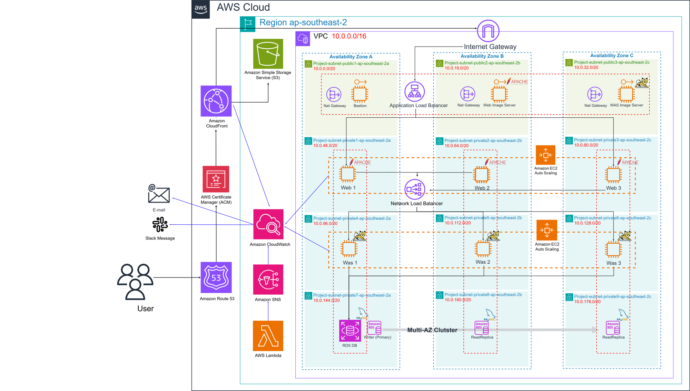

# 3-Tier Architecture — 글로벌 서비스향 고가용성 AWS 인프라 구축

글로벌 C2C 마켓플레이스의 해외 진출 시나리오를 가정하고, 대규모 트래픽을 안정적으로 처리할 수 있는 고가용성 AWS 3-Tier 인프라를 단독으로 설계·구축한 프로젝트입니다.

**기간**: 2024.12.20 – 2025.01.24 (단독 설계·구축)

**서비스 배포**: `3tierarchitectureproject-hn.store` *(프로젝트 기간 종료로 현재는 운영되지 않습니다)*

---

## 시나리오 & 목표

**배경**

- 글로벌 C2C 마켓플레이스 플랫폼의 남태평양 진출
- MAU 1,000만 명 이상의 대규모 트래픽 처리
- 현지화된 서비스 제공 및 글로벌 확장성 고려

**목표 대비 실측 결과**

| 항목 | 목표 | 실측 결과 |
|---|---|---|
| 지연시간 | 150ms 이하 | **25ms** (content.css 리소스 기준) |
| 서비스 가용성 | 99.99% 이상 | 다중 가용영역 구성으로 확보 |
| 장애 복구(RTO) | 10분 이내 | **5분** (00:05:00.91, RDS Multi-AZ 강제종료 복구 테스트) |

---

## 아키텍처

3개 가용영역(AZ)에 걸쳐 Web·WAS·DB 계층을 분리한 구조입니다.

**Network**

VPC(10.0.0.0/16), AZ별 Public/Private 서브넷 분리, Internet Gateway, NAT Gateway

**Web/WAS 계층**

Application Load Balancer(Web) + Network Load Balancer(WAS), EC2 Auto Scaling으로 3개 AZ에 이중화

**DB 계층**

RDS Multi-AZ 클러스터 (Writer 1 + Read Replica 2)

**부가 서비스**

Route 53(도메인 연결), CloudFront(HTTP→HTTPS 리디렉션), CloudWatch(모니터링), SNS+Lambda(장애 알림 자동화 — Slack/이메일)

**테스트 워크로드**

Spring PetClinic(오픈소스 샘플 앱)을 배포해 DB 연결·Auto Scaling·장애 복구 등 인프라 동작 검증

---

## 검증 결과 (Evidence)

실제 콘솔/터미널 화면 녹화로 각 목표 달성을 검증했습니다.

| 테스트 | 내용 |
|---|---|
| Auto Scaling + PetClinic | 트래픽 증가 시 인스턴스 자동 확장 및 애플리케이션 정상 동작 확인 |
| CloudWatch 대시보드 | 모니터링 대시보드 구성 시연 |
| Latency 테스트 | ALB/CloudFront 도메인 기준 150ms 이하 확인 |
| Alarm 테스트(인스턴스 종료) | Web/WAS 인스턴스 종료 시 Slack/이메일 알림 확인 |
| Alarm 테스트(CPU 사용률) | Web/WAS CPU 사용률 임계치 도달 시 알림 확인 |
| RDS 장애 복구(RTO) | RDS Multi-AZ 인스턴스 강제 종료 → 5분(00:05:00.91) 내 복구 확인 |

**녹화 영상 전체**: [Google Drive 🔗](https://drive.google.com/drive/folders/1g_YJ7fKY2FJCyy3DFw9vW4FEcyqRg_0U?usp=sharing)

---

## 사용 기술

AWS (VPC, ALB, NLB, EC2 Auto Scaling, RDS Multi-AZ, Route 53, CloudFront, ACM, CloudWatch, SNS, Lambda, S3)
